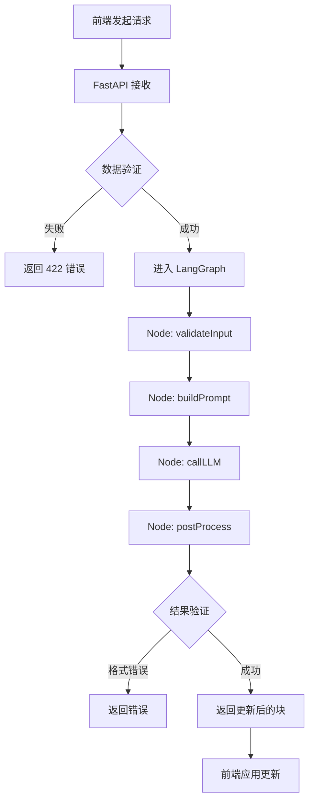

# Markdown 局部编辑工具 - 后端设计文档

## 文档概述

本文档分为两部分：
- **第一部分（流程梳理设计）**：描述后端整体架构、与 LangChain/LangGraph 的集成方案、核心流程设计
- **第二部分（具体实现）**：基于 Python + FastAPI 的完整代码实现

---

# 第一部分：流程梳理与架构设计

## 1. 后端架构总览

### 1.1 架构图

```
┌─────────────────────────────────────────────────────────┐
│                    Frontend (Vue 3)                     │
│                                                         │
│  [MarkdownEditor] → [Selection] → [LLM Request]        │
└───────────────────────┬─────────────────────────────────┘
                        │ HTTP/REST
                        ↓
┌─────────────────────────────────────────────────────────┐
│                  Backend (FastAPI)                      │
│                                                         │
│  ┌─────────────────────────────────────────────────┐   │
│  │          API Layer (FastAPI Routes)             │   │
│  │  - POST /api/markdown/edit                      │   │
│  │  - POST /api/markdown/edit/stream               │   │
│  └────────────────────┬────────────────────────────┘   │
│                       ↓                                 │
│  ┌─────────────────────────────────────────────────┐   │
│  │       Service Layer (Business Logic)            │   │
│  │  - MarkdownEditService                          │   │
│  │  - PromptBuilder                                │   │
│  │  - BlockReplacer                                │   │
│  └────────────────────┬────────────────────────────┘   │
│                       ↓                                 │
│  ┌─────────────────────────────────────────────────┐   │
│  │      LangChain/LangGraph Integration            │   │
│  │  - StateGraph Definition                        │   │
│  │  - Node: validateInput                          │   │
│  │  - Node: buildPrompt                            │   │
│  │  - Node: callLLM                                │   │
│  │  - Node: postProcess                            │   │
│  └────────────────────┬────────────────────────────┘   │
│                       ↓                                 │
│  ┌─────────────────────────────────────────────────┐   │
│  │          LLM Provider (OpenAI/Anthropic)        │   │
│  └─────────────────────────────────────────────────┘   │
└─────────────────────────────────────────────────────────┘
```

### 1.2 技术栈

| 技术领域 | 选型 | 版本 | 说明 |
|---------|------|------|------|
| Web 框架 | FastAPI | ^0.109.0 | 异步、高性能、自动文档 |
| 语言 | Python | ^3.11 | 类型提示、异步支持 |
| LLM 编排 | LangGraph | ^0.2.0 | 状态图工作流 |
| LLM 框架 | LangChain | ^0.1.0 | 提示模板、模型抽象 |
| Markdown 解析 | markdown-it-py | ^3.0.0 | Python Markdown 解析器 |
| 异步 HTTP | httpx | ^0.26.0 | 用于异步请求 |
| 数据验证 | Pydantic | ^2.5.0 | FastAPI 内置 |
| 配置管理 | python-dotenv | ^1.0.0 | 环境变量管理 |

---

## 2. 核心流程设计

### 2.1 局部编辑请求流程



### 2.2 LangGraph 状态图设计

LangGraph 使用有向图来管理多步骤的 LLM 调用流程，每个节点代表一个处理步骤。

#### 状态定义

```python
from typing import TypedDict, Optional
from langchain_core.messages import BaseMessage

class MarkdownEditState(TypedDict):
    """状态对象，在各节点间传递"""
    # 输入
    selected_text: str          # 选中的文本
    markdown_block: str         # 所在的完整块
    full_markdown: str          # 完整文档
    instruction: str            # 用户指令
    
    # 中间状态
    system_prompt: Optional[str]    # 系统提示词
    user_message: Optional[str]     # 用户消息
    messages: list[BaseMessage]     # 消息历史
    
    # 输出
    updated_block: Optional[str]    # LLM 返回的新块
    error: Optional[str]            # 错误信息
    success: bool                   # 是否成功
```

#### 节点功能

1. **validateInput 节点**
   - 验证输入参数完整性
   - 检查 `selected_text` 是否在 `markdown_block` 中
   - 检查 `markdown_block` 是否在 `full_markdown` 中
   - 验证失败时设置 `error` 并短路

2. **buildPrompt 节点**
   - 构造系统提示词（System Prompt）
   - 约束 LLM 只修改 `selected_text` 部分
   - 要求返回完整的 `markdown_block`（带修改）
   - 严格禁止多余文本（如 "Here's the result:"）

3. **callLLM 节点**
   - 调用 LangChain 的 ChatModel
   - 支持多种模型（OpenAI、Anthropic、本地模型）
   - 处理流式/非流式响应
   - 异常处理（超时、Rate Limit 等）

4. **postProcess 节点**
   - 清理 LLM 返回内容（去除代码块标记、多余空白）
   - 验证返回内容是否为有效 Markdown
   - 验证修改部分是否符合预期
   - 生成最终的 `updated_block`

#### 路由逻辑

```python
def route_after_validate(state: MarkdownEditState) -> str:
    """验证后的路由"""
    if state.get("error"):
        return "error"
    return "buildPrompt"

def route_after_llm(state: MarkdownEditState) -> str:
    """LLM 调用后的路由"""
    if state.get("error"):
        return "error"
    return "postProcess"
```

---

## 3. Prompt 设计策略

### 3.1 System Prompt 模板

```python
SYSTEM_PROMPT_TEMPLATE = """你是一个 Markdown 局部编辑助手。

## 任务
用户会提供：
1. 一段选中的文本（selected_text）
2. 包含这段文本的完整 Markdown 块（markdown_block）
3. 修改指令（instruction）

你需要：
- 根据指令修改 selected_text 部分
- 保持块内其他内容不变（除非为保证语义连贯所必需）
- 返回完整的修改后 markdown_block

## 严格要求
1. **只返回修改后的 markdown_block**，不要有任何前后说明文字
2. **不要用代码块包裹**（如 ```markdown），直接返回原始 Markdown
3. **不要改变块的类型**（如段落不要变成标题）
4. **保持原有格式**（缩进、换行、列表符号等）
5. **如果指令不明确，做最小化修改**

## 示例

输入：
- selected_text: "这是一个测试"
- markdown_block: "这是一个测试段落，包含更多内容。"
- instruction: "改为英文"

正确输出：
This is a test段落，包含更多内容。

错误输出（不要这样）：
```markdown
This is a test段落，包含更多内容。
```

错误输出（不要这样）：
Here's the updated text:
This is a test段落，包含更多内容。
"""

USER_MESSAGE_TEMPLATE = """请根据以下信息进行修改：

【选中的文本】
{selected_text}

【所在的完整块】
{markdown_block}

【修改指令】
{instruction}

【上下文参考（可选）】
{context_preview}

请直接返回修改后的完整块内容。
"""
```

### 3.2 Few-shot Examples

为了提高 LLM 理解能力，可以在 System Prompt 中加入更多示例：

```python
FEW_SHOT_EXAMPLES = [
    {
        "selected_text": "Python 是一种高级编程语言",
        "markdown_block": "Python 是一种高级编程语言，广泛用于数据科学和 Web 开发。",
        "instruction": "润色为更专业的表达",
        "output": "Python 是一种高级、解释型编程语言，广泛应用于数据科学和 Web 开发领域。"
    },
    {
        "selected_text": "```python\nprint('hello')\n```",
        "markdown_block": "以下是示例代码：\n\n```python\nprint('hello')\n```\n\n这段代码会输出 hello。",
        "instruction": "修改代码为输出 world",
        "output": "以下是示例代码：\n\n```python\nprint('world')\n```\n\n这段代码会输出 world。"
    }
]
```

---

## 4. 错误处理与重试策略

### 4.1 错误分类

| 错误类型 | HTTP 状态码 | 描述 | 处理策略 |
|---------|------------|------|---------|
| 输入验证失败 | 422 | 参数缺失或格式错误 | 返回详细错误信息，前端提示 |
| LLM API 超时 | 504 | 模型调用超时 | 重试 3 次，指数退避 |
| LLM API Rate Limit | 429 | 超出速率限制 | 等待后重试 |
| LLM 返回格式错误 | 500 | 返回内容不符合要求 | 尝试清洗，失败则返回原文 |
| 系统内部错误 | 500 | 未预期的异常 | 记录日志，返回通用错误 |

### 4.2 重试机制

```python
from tenacity import (
    retry,
    stop_after_attempt,
    wait_exponential,
    retry_if_exception_type
)

@retry(
    stop=stop_after_attempt(3),
    wait=wait_exponential(multiplier=1, min=2, max=10),
    retry=retry_if_exception_type((TimeoutError, httpx.ReadTimeout))
)
async def call_llm_with_retry(messages: list) -> str:
    """带重试的 LLM 调用"""
    response = await llm.ainvoke(messages)
    return response.content
```

---

## 5. 流式响应设计（可选）

### 5.1 流式 API 端点

```
POST /api/markdown/edit/stream
```

返回 Server-Sent Events (SSE)：

```
data: {"type": "start", "message": "开始处理"}

data: {"type": "chunk", "content": "这是"}

data: {"type": "chunk", "content": "修改后"}

data: {"type": "chunk", "content": "的内容"}

data: {"type": "done", "full_content": "这是修改后的内容"}
```

### 5.2 流式处理流程

LangGraph 支持流式输出，可以在 `callLLM` 节点中启用：

```python
async def call_llm_streaming(state: MarkdownEditState):
    """流式 LLM 调用"""
    accumulated = ""
    async for chunk in llm.astream(state["messages"]):
        accumulated += chunk.content
        yield {
            "type": "chunk",
            "content": chunk.content
        }
    
    state["updated_block"] = accumulated
    yield {
        "type": "done",
        "full_content": accumulated
    }
```

---

## 6. 安全性设计

### 6.1 输入验证

- **长度限制**：
  - `selected_text`: 最大 10,000 字符
  - `markdown_block`: 最大 20,000 字符
  - `full_markdown`: 最大 100,000 字符
  - `instruction`: 最大 500 字符

- **内容过滤**：
  - 检测并拒绝恶意 Prompt Injection 尝试
  - 过滤特殊字符（如控制字符）

### 6.2 API 安全

- **认证**：API Key 验证（HTTP Header: `X-API-Key`）
- **速率限制**：每个 IP/用户每分钟最多 10 次请求
- **CORS**：配置允许的前端域名
- **敏感信息**：LLM API Key 通过环境变量管理，不硬编码

### 6.3 日志与监控

- 记录所有 API 请求（不记录敏感内容）
- 记录 LLM 调用详情（输入 token 数、输出 token 数、耗时）
- 异常告警（错误率超过 5% 时发送通知）

---

## 7. 性能优化

### 7.1 缓存策略

对于相同的 `(markdown_block, selected_text, instruction)` 组合，可以缓存结果：

```python
from functools import lru_cache
import hashlib

def cache_key(selected_text: str, markdown_block: str, instruction: str) -> str:
    """生成缓存键"""
    content = f"{selected_text}|{markdown_block}|{instruction}"
    return hashlib.sha256(content.encode()).hexdigest()

# 使用 Redis 或内存缓存
# TTL: 1 小时
```

### 7.2 并发控制

使用 FastAPI 的异步特性 + 连接池：

```python
from fastapi import FastAPI
import asyncio

app = FastAPI()

# 限制并发 LLM 请求数量
semaphore = asyncio.Semaphore(10)

async def call_llm_with_semaphore(messages):
    async with semaphore:
        return await llm.ainvoke(messages)
```

### 7.3 超时设置

- LLM API 调用超时：30 秒
- 整个请求处理超时：45 秒
- 流式响应单次写入超时：5 秒

---

## 8. 可观测性

### 8.1 日志规范

使用结构化日志（JSON 格式）：

```python
import logging
import json

logger = logging.getLogger(__name__)

def log_request(request_id: str, endpoint: str, params: dict):
    logger.info(json.dumps({
        "event": "api_request",
        "request_id": request_id,
        "endpoint": endpoint,
        "params_keys": list(params.keys()),
        "timestamp": datetime.utcnow().isoformat()
    }))
```

### 8.2 指标收集

使用 Prometheus 格式：

- `markdown_edit_requests_total`: 总请求数（标签：endpoint, status）
- `markdown_edit_duration_seconds`: 请求耗时分布
- `llm_calls_total`: LLM 调用次数（标签：model, success）
- `llm_tokens_used`: Token 使用量（标签：model, type）

---

# 第二部分：Python + FastAPI 具体实现

## 9. 项目结构

```
backend/
├── app/
│   ├── __init__.py
│   ├── main.py                 # FastAPI 应用入口
│   ├── config.py               # 配置管理
│   ├── api/
│   │   ├── __init__.py
│   │   ├── routes.py           # API 路由定义
│   │   └── dependencies.py     # 依赖注入
│   ├── services/
│   │   ├── __init__.py
│   │   ├── markdown_service.py # 业务逻辑
│   │   └── llm_service.py      # LLM 调用封装
│   ├── langgraph_flows/
│   │   ├── __init__.py
│   │   ├── markdown_edit_graph.py  # LangGraph 定义
│   │   └── nodes.py            # 各节点实现
│   ├── schemas/
│   │   ├── __init__.py
│   │   └── markdown.py         # Pydantic 模型
│   ├── utils/
│   │   ├── __init__.py
│   │   ├── markdown_parser.py  # Markdown 解析
│   │   ├── prompt_builder.py   # Prompt 构建
│   │   └── logger.py           # 日志工具
│   └── middleware/
│       ├── __init__.py
│       ├── auth.py             # 认证中间件
│       └── rate_limit.py       # 速率限制
├── tests/
│   ├── __init__.py
│   ├── test_api.py
│   ├── test_services.py
│   └── test_langgraph.py
├── .env.example
├── requirements.txt
├── Dockerfile
└── README.md
```

---

## 10. 核心代码实现

### 10.1 配置管理 (config.py)

```python
# app/config.py
from pydantic_settings import BaseSettings
from functools import lru_cache

class Settings(BaseSettings):
    """应用配置"""
    # API 配置
    API_V1_PREFIX: str = "/api"
    PROJECT_NAME: str = "Markdown Edit API"
    VERSION: str = "1.0.0"
    
    # LLM 配置
    OPENAI_API_KEY: str
    OPENAI_MODEL: str = "gpt-4o-mini"
    OPENAI_TEMPERATURE: float = 0.3
    OPENAI_MAX_TOKENS: int = 2000
    
    # 安全配置
    API_KEY: str = "your-secret-api-key"
    ALLOWED_ORIGINS: list[str] = ["http://localhost:5173"]
    
    # 限制配置
    MAX_SELECTED_TEXT_LENGTH: int = 10000
    MAX_MARKDOWN_BLOCK_LENGTH: int = 20000
    MAX_FULL_MARKDOWN_LENGTH: int = 100000
    MAX_INSTRUCTION_LENGTH: int = 500
    
    # 性能配置
    LLM_TIMEOUT: int = 30
    REQUEST_TIMEOUT: int = 45
    MAX_CONCURRENT_LLM_CALLS: int = 10
    
    # 日志配置
    LOG_LEVEL: str = "INFO"
    
    class Config:
        env_file = ".env"
        case_sensitive = True

@lru_cache()
def get_settings() -> Settings:
    """获取配置单例"""
    return Settings()
```

---

### 10.2 数据模型 (schemas/markdown.py)

```python
# app/schemas/markdown.py
from pydantic import BaseModel, Field, field_validator

class MarkdownEditRequest(BaseModel):
    """编辑请求"""
    selected_text: str = Field(..., description="选中的文本")
    markdown_block: str = Field(..., description="所在的完整块")
    full_markdown: str = Field(..., description="完整文档")
    instruction: str = Field(..., description="修改指令")
    
    @field_validator("selected_text")
    @classmethod
    def validate_selected_text(cls, v: str) -> str:
        if not v or not v.strip():
            raise ValueError("selected_text 不能为空")
        if len(v) > 10000:
            raise ValueError("selected_text 长度不能超过 10000 字符")
        return v.strip()
    
    @field_validator("markdown_block")
    @classmethod
    def validate_markdown_block(cls, v: str) -> str:
        if not v or not v.strip():
            raise ValueError("markdown_block 不能为空")
        if len(v) > 20000:
            raise ValueError("markdown_block 长度不能超过 20000 字符")
        return v
    
    @field_validator("instruction")
    @classmethod
    def validate_instruction(cls, v: str) -> str:
        if not v or not v.strip():
            raise ValueError("instruction 不能为空")
        if len(v) > 500:
            raise ValueError("instruction 长度不能超过 500 字符")
        return v.strip()
    
    def model_post_init(self, __context):
        """验证 selected_text 是否在 markdown_block 中"""
        if self.selected_text not in self.markdown_block:
            raise ValueError("selected_text 必须包含在 markdown_block 中")
        if self.markdown_block not in self.full_markdown:
            raise ValueError("markdown_block 必须包含在 full_markdown 中")

class MarkdownEditResponse(BaseModel):
    """编辑响应"""
    success: bool = Field(..., description="是否成功")
    updated_block: str | None = Field(None, description="更新后的块")
    error: str | None = Field(None, description="错误信息")
    
class StreamChunk(BaseModel):
    """流式响应块"""
    type: str = Field(..., description="类型：start/chunk/done/error")
    content: str | None = Field(None, description="内容")
    full_content: str | None = Field(None, description="完整内容（仅 done 时）")
    message: str | None = Field(None, description="提示信息")
```

---

### 10.3 LangGraph 工作流定义 (langgraph_flows/markdown_edit_graph.py)

```python
# app/langgraph_flows/markdown_edit_graph.py
from typing import TypedDict, Annotated, Literal
from langgraph.graph import StateGraph, END
from langchain_core.messages import HumanMessage, SystemMessage
from .nodes import (
    validate_input_node,
    build_prompt_node,
    call_llm_node,
    post_process_node
)

class MarkdownEditState(TypedDict):
    """工作流状态"""
    # 输入
    selected_text: str
    markdown_block: str
    full_markdown: str
    instruction: str
    
    # 中间状态
    system_prompt: str | None
    user_message: str | None
    messages: list
    
    # 输出
    updated_block: str | None
    error: str | None
    success: bool

def route_after_validate(state: MarkdownEditState) -> Literal["build_prompt", "error"]:
    """验证后路由"""
    if state.get("error"):
        return "error"
    return "build_prompt"

def route_after_llm(state: MarkdownEditState) -> Literal["post_process", "error"]:
    """LLM 调用后路由"""
    if state.get("error"):
        return "error"
    return "post_process"

def create_markdown_edit_graph() -> StateGraph:
    """创建 Markdown 编辑工作流图"""
    
    # 创建状态图
    workflow = StateGraph(MarkdownEditState)
    
    # 添加节点
    workflow.add_node("validate_input", validate_input_node)
    workflow.add_node("build_prompt", build_prompt_node)
    workflow.add_node("call_llm", call_llm_node)
    workflow.add_node("post_process", post_process_node)
    workflow.add_node("error", lambda state: state)  # 错误节点
    
    # 设置入口
    workflow.set_entry_point("validate_input")
    
    # 添加条件边
    workflow.add_conditional_edges(
        "validate_input",
        route_after_validate,
        {
            "build_prompt": "build_prompt",
            "error": "error"
        }
    )
    
    # 添加普通边
    workflow.add_edge("build_prompt", "call_llm")
    
    workflow.add_conditional_edges(
        "call_llm",
        route_after_llm,
        {
            "post_process": "post_process",
            "error": "error"
        }
    )
    
    # 添加结束边
    workflow.add_edge("post_process", END)
    workflow.add_edge("error", END)
    
    return workflow.compile()

# 创建全局图实例
markdown_edit_graph = create_markdown_edit_graph()
```

---

### 10.4 工作流节点实现 (langgraph_flows/nodes.py)

```python
# app/langgraph_flows/nodes.py
from langchain_openai import ChatOpenAI
from langchain_core.messages import SystemMessage, HumanMessage
from app.config import get_settings
from app.utils.prompt_builder import build_system_prompt, build_user_message
from app.utils.markdown_parser import clean_llm_response
import logging

logger = logging.getLogger(__name__)
settings = get_settings()

# 初始化 LLM
llm = ChatOpenAI(
    model=settings.OPENAI_MODEL,
    temperature=settings.OPENAI_TEMPERATURE,
    max_tokens=settings.OPENAI_MAX_TOKENS,
    timeout=settings.LLM_TIMEOUT,
    api_key=settings.OPENAI_API_KEY
)

def validate_input_node(state: dict) -> dict:
    """节点1：验证输入"""
    try:
        selected_text = state["selected_text"]
        markdown_block = state["markdown_block"]
        full_markdown = state["full_markdown"]
        instruction = state["instruction"]
        
        # 验证选中文本在块中
        if selected_text not in markdown_block:
            state["error"] = "选中文本不在 markdown_block 中"
            state["success"] = False
            return state
        
        # 验证块在完整文档中
        if markdown_block not in full_markdown:
            state["error"] = "markdown_block 不在 full_markdown 中"
            state["success"] = False
            return state
        
        logger.info(f"输入验证通过，指令：{instruction[:50]}...")
        state["success"] = True
        return state
        
    except Exception as e:
        logger.error(f"输入验证失败：{str(e)}")
        state["error"] = f"输入验证失败：{str(e)}"
        state["success"] = False
        return state

def build_prompt_node(state: dict) -> dict:
    """节点2：构建 Prompt"""
    try:
        # 构建系统提示词
        system_prompt = build_system_prompt()
        
        # 构建用户消息
        user_message = build_user_message(
            selected_text=state["selected_text"],
            markdown_block=state["markdown_block"],
            instruction=state["instruction"],
            full_markdown=state["full_markdown"]
        )
        
        # 构建消息列表
        messages = [
            SystemMessage(content=system_prompt),
            HumanMessage(content=user_message)
        ]
        
        state["system_prompt"] = system_prompt
        state["user_message"] = user_message
        state["messages"] = messages
        
        logger.info("Prompt 构建完成")
        return state
        
    except Exception as e:
        logger.error(f"Prompt 构建失败：{str(e)}")
        state["error"] = f"Prompt 构建失败：{str(e)}"
        state["success"] = False
        return state

def call_llm_node(state: dict) -> dict:
    """节点3：调用 LLM"""
    try:
        messages = state["messages"]
        
        logger.info(f"开始调用 LLM，模型：{settings.OPENAI_MODEL}")
        
        # 同步调用 LLM
        response = llm.invoke(messages)
        
        # 提取内容
        updated_block = response.content
        
        state["updated_block"] = updated_block
        
        logger.info(f"LLM 调用成功，返回长度：{len(updated_block)}")
        return state
        
    except Exception as e:
        logger.error(f"LLM 调用失败：{str(e)}")
        state["error"] = f"LLM 调用失败：{str(e)}"
        state["success"] = False
        return state

def post_process_node(state: dict) -> dict:
    """节点4：后处理"""
    try:
        updated_block = state["updated_block"]
        
        # 清理 LLM 响应
        cleaned_block = clean_llm_response(updated_block)
        
        # 验证清理后的内容不为空
        if not cleaned_block or not cleaned_block.strip():
            state["error"] = "LLM 返回内容为空"
            state["success"] = False
            return state
        
        state["updated_block"] = cleaned_block
        state["success"] = True
        
        logger.info("后处理完成")
        return state
        
    except Exception as e:
        logger.error(f"后处理失败：{str(e)}")
        state["error"] = f"后处理失败：{str(e)}"
        state["success"] = False
        return state
```

---

### 10.5 Prompt 构建工具 (utils/prompt_builder.py)

```python
# app/utils/prompt_builder.py

SYSTEM_PROMPT_TEMPLATE = """你是一个专业的 Markdown 局部编辑助手。

## 核心任务
根据用户提供的：
1. 选中的文本片段（selected_text）
2. 包含该片段的完整 Markdown 块（markdown_block）
3. 修改指令（instruction）

你需要：
- 仅修改 selected_text 对应的部分
- 保持块内其他内容完全不变
- 返回修改后的完整 markdown_block

## 严格规则（必须遵守）
1. **只返回修改后的 markdown_block**，不要有任何额外说明
2. **不要用 ```markdown 代码块包裹**，直接返回原始 Markdown 文本
3. **保持原有格式**：缩进、换行、列表符号、标题级别等
4. **不要改变块的结构类型**（段落不变标题，列表不变代码块）
5. **如果指令模糊，做最保守的修改**
6. **绝对不要输出 "Here's the result:" 这类引导语**

## 示例1：段落润色

输入：
- selected_text: "Python 很好用"
- markdown_block: "Python 很好用，适合初学者学习编程。"
- instruction: "改为更专业的表达"

正确输出：
Python 是一种语法简洁、易于上手的编程语言，适合初学者学习编程。

错误输出（不要这样）：
```markdown
Python 是一种语法简洁、易于上手的编程语言，适合初学者学习编程。
```

## 示例2：代码块修改

输入：
- selected_text: "print('hello')"
- markdown_block: "```python\\nprint('hello')\\n```"
- instruction: "改为输出 world"

正确输出：
```python
print('world')
```

## 示例3：列表项修改

输入：
- selected_text: "第一项"
- markdown_block: "- 第一项\\n- 第二项\\n- 第三项"
- instruction: "改为 Item 1"

正确输出：
- Item 1
- 第二项
- 第三项

## 特殊情况处理
- 如果 selected_text 跨越多个段落，只在 markdown_block 范围内修改
- 如果指令要求删除内容，保留块结构但删除对应文本
- 如果指令不可执行，返回原 markdown_block 不变
"""

def build_system_prompt() -> str:
    """构建系统提示词"""
    return SYSTEM_PROMPT_TEMPLATE

def build_user_message(
    selected_text: str,
    markdown_block: str,
    instruction: str,
    full_markdown: str
) -> str:
    """构建用户消息"""
    
    # 提取上下文（markdown_block 前后各 200 字符）
    context_preview = ""
    if markdown_block in full_markdown:
        start_idx = full_markdown.index(markdown_block)
        context_start = max(0, start_idx - 200)
        context_end = min(len(full_markdown), start_idx + len(markdown_block) + 200)
        context_preview = full_markdown[context_start:context_end]
    
    message = f"""请根据以下信息进行修改：

【选中的文本】
{selected_text}

【所在的完整块】
{markdown_block}

【修改指令】
{instruction}

【上下文参考（前后 200 字符）】
...{context_preview}...

请直接返回修改后的完整块内容，不要有任何额外说明。
"""
    return message
```

---

### 10.6 Markdown 工具函数 (utils/markdown_parser.py)

```python
# app/utils/markdown_parser.py
import re

def clean_llm_response(response: str) -> str:
    """清理 LLM 响应内容"""
    
    # 去除前后空白
    cleaned = response.strip()
    
    # 移除常见的引导语
    prefixes_to_remove = [
        "Here's the updated text:",
        "Here's the result:",
        "Updated content:",
        "修改后的内容：",
        "修改后：",
        "结果：",
    ]
    
    for prefix in prefixes_to_remove:
        if cleaned.startswith(prefix):
            cleaned = cleaned[len(prefix):].strip()
    
    # 移除 Markdown 代码块包裹
    # 匹配 ```markdown\n...\n``` 或 ```\n...\n```
    markdown_block_pattern = r'^```(?:markdown)?\s*\n(.*)\n```$'
    match = re.match(markdown_block_pattern, cleaned, re.DOTALL)
    if match:
        cleaned = match.group(1).strip()
    
    # 移除多余的空行（超过 2 个连续换行符压缩为 2 个）
    cleaned = re.sub(r'\n{3,}', '\n\n', cleaned)
    
    return cleaned

def validate_markdown_block(block: str) -> bool:
    """验证是否为有效的 Markdown 块"""
    if not block or not block.strip():
        return False
    
    # 基础验证：至少包含一些可见字符
    if len(block.strip()) < 1:
        return False
    
    return True

def find_block_in_markdown(full_markdown: str, target_block: str) -> int:
    """查找块在完整文档中的位置"""
    return full_markdown.find(target_block)

def replace_block_in_markdown(
    full_markdown: str,
    old_block: str,
    new_block: str
) -> str:
    """替换文档中的块"""
    if old_block not in full_markdown:
        raise ValueError("目标块不在文档中")
    
    # 只替换第一次出现
    return full_markdown.replace(old_block, new_block, 1)
```

---

### 10.7 服务层 (services/markdown_service.py)

```python
# app/services/markdown_service.py
from app.schemas.markdown import MarkdownEditRequest, MarkdownEditResponse
from app.langgraph_flows.markdown_edit_graph import markdown_edit_graph
import logging

logger = logging.getLogger(__name__)

class MarkdownEditService:
    """Markdown 编辑服务"""
    
    @staticmethod
    async def edit_markdown(request: MarkdownEditRequest) -> MarkdownEditResponse:
        """执行 Markdown 局部编辑"""
        
        try:
            # 准备输入状态
            input_state = {
                "selected_text": request.selected_text,
                "markdown_block": request.markdown_block,
                "full_markdown": request.full_markdown,
                "instruction": request.instruction,
                "success": False,
            }
            
            logger.info(f"开始处理编辑请求，指令：{request.instruction[:50]}...")
            
            # 执行工作流
            result = markdown_edit_graph.invoke(input_state)
            
            # 检查结果
            if result.get("success") and result.get("updated_block"):
                logger.info("编辑成功")
                return MarkdownEditResponse(
                    success=True,
                    updated_block=result["updated_block"],
                    error=None
                )
            else:
                error_msg = result.get("error", "未知错误")
                logger.error(f"编辑失败：{error_msg}")
                return MarkdownEditResponse(
                    success=False,
                    updated_block=None,
                    error=error_msg
                )
                
        except Exception as e:
            logger.error(f"编辑过程发生异常：{str(e)}", exc_info=True)
            return MarkdownEditResponse(
                success=False,
                updated_block=None,
                error=f"服务器内部错误：{str(e)}"
            )
```

---

### 10.8 API 路由 (api/routes.py)

```python
# app/api/routes.py
from fastapi import APIRouter, Depends, HTTPException, Header
from app.schemas.markdown import MarkdownEditRequest, MarkdownEditResponse
from app.services.markdown_service import MarkdownEditService
from app.config import get_settings
import logging

logger = logging.getLogger(__name__)
router = APIRouter(prefix="/markdown", tags=["markdown"])
settings = get_settings()

async def verify_api_key(x_api_key: str = Header(...)):
    """验证 API Key"""
    if x_api_key != settings.API_KEY:
        raise HTTPException(status_code=401, detail="无效的 API Key")
    return True

@router.post(
    "/edit",
    response_model=MarkdownEditResponse,
    summary="局部编辑 Markdown",
    description="对 Markdown 文档中的选中部分进行 AI 编辑"
)
async def edit_markdown(
    request: MarkdownEditRequest,
    _: bool = Depends(verify_api_key)
) -> MarkdownEditResponse:
    """
    局部编辑 Markdown 文档
    
    **请求体：**
    - selected_text: 选中的文本
    - markdown_block: 包含选中文本的完整块
    - full_markdown: 完整文档（用于上下文参考）
    - instruction: 修改指令
    
    **响应：**
    - success: 是否成功
    - updated_block: 更新后的块（成功时）
    - error: 错误信息（失败时）
    """
    
    logger.info(f"收到编辑请求，选中文本长度：{len(request.selected_text)}")
    
    service = MarkdownEditService()
    response = await service.edit_markdown(request)
    
    # 如果失败，根据错误类型返回不同的 HTTP 状态码
    if not response.success:
        if "验证失败" in response.error:
            raise HTTPException(status_code=422, detail=response.error)
        elif "超时" in response.error:
            raise HTTPException(status_code=504, detail=response.error)
        else:
            raise HTTPException(status_code=500, detail=response.error)
    
    return response

@router.get("/health", summary="健康检查")
async def health_check():
    """健康检查端点"""
    return {
        "status": "healthy",
        "service": "markdown-edit-api",
        "version": settings.VERSION
    }
```

---

### 10.9 主应用入口 (main.py)

```python
# app/main.py
from fastapi import FastAPI
from fastapi.middleware.cors import CORSMiddleware
from app.config import get_settings
from app.api.routes import router as markdown_router
import logging
import sys

# 配置日志
logging.basicConfig(
    level=logging.INFO,
    format='%(asctime)s - %(name)s - %(levelname)s - %(message)s',
    handlers=[
        logging.StreamHandler(sys.stdout)
    ]
)

logger = logging.getLogger(__name__)
settings = get_settings()

# 创建 FastAPI 应用
app = FastAPI(
    title=settings.PROJECT_NAME,
    version=settings.VERSION,
    description="Markdown 局部编辑 API，基于 LangChain/LangGraph",
    docs_url="/docs",
    redoc_url="/redoc"
)

# 配置 CORS
app.add_middleware(
    CORSMiddleware,
    allow_origins=settings.ALLOWED_ORIGINS,
    allow_credentials=True,
    allow_methods=["*"],
    allow_headers=["*"],
)

# 注册路由
app.include_router(markdown_router, prefix=settings.API_V1_PREFIX)

@app.on_event("startup")
async def startup_event():
    """应用启动事件"""
    logger.info(f"{settings.PROJECT_NAME} 启动成功")
    logger.info(f"API 文档地址：http://localhost:8000/docs")

@app.on_event("shutdown")
async def shutdown_event():
    """应用关闭事件"""
    logger.info(f"{settings.PROJECT_NAME} 已关闭")

@app.get("/")
async def root():
    """根路径"""
    return {
        "message": "Markdown Edit API",
        "version": settings.VERSION,
        "docs": "/docs"
    }

if __name__ == "__main__":
    import uvicorn
    uvicorn.run(
        "app.main:app",
        host="0.0.0.0",
        port=8000,
        reload=True,
        log_level="info"
    )
```

---

## 11. 依赖文件

### 11.1 requirements.txt

```txt
# Web 框架
fastapi==0.109.0
uvicorn[standard]==0.27.0
pydantic==2.5.0
pydantic-settings==2.1.0

# LangChain 生态
langchain==0.1.0
langchain-openai==0.0.2
langchain-core==0.1.0
langgraph==0.2.0

# HTTP 客户端
httpx==0.26.0

# Markdown 解析
markdown-it-py==3.0.0

# 工具库
python-dotenv==1.0.0
tenacity==8.2.3

# 日志与监控
python-json-logger==2.0.7

# 开发依赖
pytest==7.4.3
pytest-asyncio==0.21.1
pytest-cov==4.1.0
black==23.12.1
ruff==0.1.9
```

---

### 11.2 .env.example

```bash
# OpenAI 配置
OPENAI_API_KEY=sk-your-openai-api-key-here
OPENAI_MODEL=gpt-4o-mini
OPENAI_TEMPERATURE=0.3
OPENAI_MAX_TOKENS=2000

# API 安全
API_KEY=your-secret-api-key-change-in-production
ALLOWED_ORIGINS=["http://localhost:5173","http://localhost:3000"]

# 服务配置
LOG_LEVEL=INFO
MAX_CONCURRENT_LLM_CALLS=10
LLM_TIMEOUT=30
REQUEST_TIMEOUT=45

# 限制配置
MAX_SELECTED_TEXT_LENGTH=10000
MAX_MARKDOWN_BLOCK_LENGTH=20000
MAX_FULL_MARKDOWN_LENGTH=100000
MAX_INSTRUCTION_LENGTH=500
```

---

## 12. 测试示例

### 12.1 单元测试 (tests/test_services.py)

```python
# tests/test_services.py
import pytest
from app.schemas.markdown import MarkdownEditRequest
from app.services.markdown_service import MarkdownEditService

@pytest.mark.asyncio
async def test_edit_markdown_success():
    """测试成功的编辑"""
    
    request = MarkdownEditRequest(
        selected_text="Python 很好用",
        markdown_block="Python 很好用，适合初学者。",
        full_markdown="# 编程语言\n\nPython 很好用，适合初学者。",
        instruction="改为更专业的表达"
    )
    
    service = MarkdownEditService()
    response = await service.edit_markdown(request)
    
    assert response.success is True
    assert response.updated_block is not None
    assert len(response.updated_block) > 0
    assert response.error is None

@pytest.mark.asyncio
async def test_edit_markdown_validation_error():
    """测试验证失败的情况"""
    
    request = MarkdownEditRequest(
        selected_text="不存在的文本",
        markdown_block="Python 很好用，适合初学者。",
        full_markdown="# 编程语言\n\nPython 很好用，适合初学者。",
        instruction="改为更专业的表达"
    )
    
    service = MarkdownEditService()
    response = await service.edit_markdown(request)
    
    assert response.success is False
    assert response.error is not None
```

---

### 12.2 API 测试 (tests/test_api.py)

```python
# tests/test_api.py
import pytest
from fastapi.testclient import TestClient
from app.main import app
from app.config import get_settings

settings = get_settings()
client = TestClient(app)

def test_health_check():
    """测试健康检查"""
    response = client.get("/api/markdown/health")
    assert response.status_code == 200
    assert response.json()["status"] == "healthy"

def test_edit_markdown_no_auth():
    """测试未认证的请求"""
    response = client.post("/api/markdown/edit", json={
        "selected_text": "test",
        "markdown_block": "test block",
        "full_markdown": "full markdown test block",
        "instruction": "modify"
    })
    assert response.status_code == 401

def test_edit_markdown_with_auth():
    """测试已认证的请求"""
    headers = {"X-API-Key": settings.API_KEY}
    response = client.post(
        "/api/markdown/edit",
        json={
            "selected_text": "Python 很好用",
            "markdown_block": "Python 很好用，适合初学者。",
            "full_markdown": "# 编程语言\n\nPython 很好用，适合初学者。",
            "instruction": "改为更专业的表达"
        },
        headers=headers
    )
    
    assert response.status_code == 200
    data = response.json()
    assert data["success"] is True
    assert "updated_block" in data
```

---

## 13. Docker 部署

### 13.1 Dockerfile

```dockerfile
# Dockerfile
FROM python:3.11-slim

WORKDIR /app

# 安装系统依赖
RUN apt-get update && apt-get install -y \
    gcc \
    && rm -rf /var/lib/apt/lists/*

# 复制依赖文件
COPY requirements.txt .

# 安装 Python 依赖
RUN pip install --no-cache-dir -r requirements.txt

# 复制应用代码
COPY app/ ./app/

# 暴露端口
EXPOSE 8000

# 启动命令
CMD ["uvicorn", "app.main:app", "--host", "0.0.0.0", "--port", "8000"]
```

### 13.2 docker-compose.yml

```yaml
# docker-compose.yml
version: '3.8'

services:
  api:
    build: .
    ports:
      - "8000:8000"
    env_file:
      - .env
    environment:
      - LOG_LEVEL=INFO
    volumes:
      - ./app:/app/app
    restart: unless-stopped
    healthcheck:
      test: ["CMD", "curl", "-f", "http://localhost:8000/api/markdown/health"]
      interval: 30s
      timeout: 10s
      retries: 3
```

---

## 14. 运行指南

### 14.1 本地开发

```bash
# 1. 安装依赖
pip install -r requirements.txt

# 2. 配置环境变量
cp .env.example .env
# 编辑 .env 填入你的 OPENAI_API_KEY

# 3. 启动服务
python -m app.main

# 4. 访问 API 文档
# http://localhost:8000/docs
```

### 14.2 Docker 部署

```bash
# 1. 构建镜像
docker build -t markdown-edit-api .

# 2. 启动容器
docker run -d \
  --name markdown-api \
  -p 8000:8000 \
  --env-file .env \
  markdown-edit-api

# 3. 查看日志
docker logs -f markdown-api
```

---

## 15. API 使用示例

### 15.1 cURL 示例

```bash
curl -X POST "http://localhost:8000/api/markdown/edit" \
  -H "Content-Type: application/json" \
  -H "X-API-Key: your-secret-api-key" \
  -d '{
    "selected_text": "Python 很好用",
    "markdown_block": "Python 很好用，适合初学者学习编程。",
    "full_markdown": "# 编程语言介绍\n\nPython 很好用，适合初学者学习编程。\n\n它有丰富的库。",
    "instruction": "改为更专业和学术的表达"
  }'
```

### 15.2 Python 客户端示例

```python
import httpx

async def edit_markdown():
    async with httpx.AsyncClient() as client:
        response = await client.post(
            "http://localhost:8000/api/markdown/edit",
            headers={"X-API-Key": "your-secret-api-key"},
            json={
                "selected_text": "Python 很好用",
                "markdown_block": "Python 很好用，适合初学者学习编程。",
                "full_markdown": "# 编程语言介绍\n\nPython 很好用，适合初学者学习编程。",
                "instruction": "改为更专业的表达"
            }
        )
        
        if response.status_code == 200:
            data = response.json()
            print("✅ 编辑成功")
            print(f"更新后的块：{data['updated_block']}")
        else:
            print(f"❌ 编辑失败：{response.text}")

# 运行
import asyncio
asyncio.run(edit_markdown())
```

---

## 16. 性能与监控

### 16.1 性能指标

- **平均响应时间**：2-5 秒（取决于 LLM 模型）
- **P95 响应时间**：< 10 秒
- **吞吐量**：10-20 请求/秒（受 LLM API 限制）
- **并发支持**：最多 10 个并发 LLM 调用

### 16.2 监控接入

可集成 Prometheus + Grafana：

```python
from prometheus_client import Counter, Histogram

# 定义指标
request_counter = Counter(
    'markdown_edit_requests_total',
    'Total edit requests',
    ['status']
)

request_duration = Histogram(
    'markdown_edit_duration_seconds',
    'Edit request duration'
)

# 在路由中使用
@request_duration.time()
async def edit_markdown(request: MarkdownEditRequest):
    result = await service.edit_markdown(request)
    request_counter.labels(status='success' if result.success else 'failed').inc()
    return result
```

---

## 17. 总结

本后端设计文档提供了：

1. **清晰的架构设计**：分层架构，职责分离
2. **LangGraph 工作流**：状态驱动的多步骤处理
3. **生产级代码**：完整的 FastAPI + LangChain 实现
4. **完善的错误处理**：验证、重试、日志
5. **可扩展性**：支持多模型、流式响应、缓存
6. **工程化配置**：Docker、测试、监控

该方案可直接用于生产环境部署，所有代码均遵循 Python 最佳实践。

---

**文档版本**：v1.0  
**最后更新**：2026-02-01  
**作者**：Qoder
