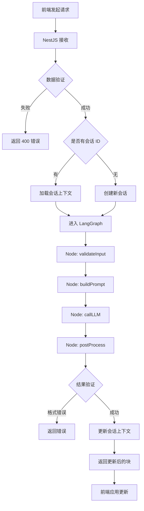

# Markdown 局部编辑工具 - NestJS 后端设计文档

## 文档概述

本文档分为两部分：

- **第一部分（流程梳理设计）**：描述后端整体架构、与 LangChain/LangGraph 的集成方案、核心流程设计、上下文管理机制
- **第二部分（具体实现）**：基于 TypeScript + NestJS 的完整代码实现，包含上下文管理功能

---

# 第一部分：流程梳理与架构设计

## 1. 后端架构总览

### 1.1 架构图

```
┌─────────────────────────────────────────────────────────┐
│                    Frontend (Vue 3)                     │
│                                                         │
│  [MarkdownEditor] → [Selection] → [LLM Request]        │
└───────────────────────┬─────────────────────────────────┘
                        │ HTTP/REST
                        ↓
┌─────────────────────────────────────────────────────────┐
│                  Backend (NestJS)                      │
│                                                         │
│  ┌─────────────────────────────────────────────────┐   │
│  │          API Layer (NestJS Controllers)         │   │
│  │  - POST /api/markdown/edit                      │   │
│  │  - POST /api/markdown/edit/stream               │   │
│  └────────────────────┬────────────────────────────┘   │
│                       ↓                                 │
│  ┌─────────────────────────────────────────────────┐   │
│  │       Service Layer (NestJS Services)           │   │
│  │  - MarkdownEditService                          │   │
│  │  - PromptBuilderService                         │   │
│  │  - BlockReplacerService                         │   │
│  │  - SessionService                               │   │
│  └────────────────────┬────────────────────────────┘   │
│                       ↓                                 │
│  ┌─────────────────────────────────────────────────┐   │
│  │         Storage Layer                           │   │
│  │  - Redis (会话存储、消息历史)                   │   │
│  │  - Cache (结果缓存)                             │   │
│  └────────────────────┬────────────────────────────┘   │
│                       ↓                                 │
│  ┌─────────────────────────────────────────────────┐   │
│  │      LangChain/LangGraph Integration            │   │
│  │  - StateGraph Definition                        │   │
│  │  - Node: validateInput                          │   │
│  │  - Node: buildPrompt                            │   │
│  │  - Node: callLLM                                │   │
│  │  - Node: postProcess                            │   │
│  └────────────────────┬────────────────────────────┘   │
│                       ↓                                 │
│  ┌─────────────────────────────────────────────────┐   │
│  │          LLM Provider (OpenAI/Anthropic)        │   │
│  └─────────────────────────────────────────────────┘   │
└─────────────────────────────────────────────────────────┘
```

### 1.2 技术栈

| 技术领域      | 选型            | 版本    | 说明                       |
| ------------- | --------------- | ------- | -------------------------- |
| Web 框架      | NestJS          | ^10.0.0 | 企业级 Node.js 框架        |
| 语言          | TypeScript      | ^5.0.0  | 类型安全                   |
| LLM 编排      | LangGraph       | ^0.2.0  | 状态图工作流               |
| LLM 框架      | LangChain       | ^0.1.0  | 提示模板、模型抽象         |
| Markdown 解析 | markdown-it     | ^14.0.0 | JavaScript Markdown 解析器 |
| 异步 HTTP     | axios           | ^1.6.0  | 用于 HTTP 请求             |
| 数据验证      | class-validator | ^0.14.0 | NestJS 内置                |
| 配置管理      | @nestjs/config  | ^3.0.0  | 环境变量管理               |
| 日志          | winston         | ^3.10.0 | 结构化日志                 |
| 认证          | passport        | ^0.7.0  | API 认证                   |
| 缓存          | redis           | ^4.6.0  | 用于缓存和速率限制         |
| 会话管理      | @nestjs/redis   | ^10.0.0 | Redis 客户端集成           |
| UUID 生成     | uuid            | ^9.0.0  | 会话 ID 生成               |

---

## 2. 核心流程设计

### 2.1 局部编辑请求流程



### 2.2 上下文管理流程

```mermaid
graph TD
    A[用户发送指令: "将 xxx 替换为 xxx"] --> B[前端发送请求]
    B --> C[NestJS 接收，包含会话 ID]
    C --> D[加载会话上下文]
    D --> E[智能内容定位]
    E --> F[识别需要替换的内容]
    F --> G[构建替换请求]
    G --> H[调用 LLM 进行替换]
    H --> I[更新会话上下文]
    I --> J[返回替换结果]
    J --> K[前端应用更新]
```

### 2.3 LangGraph 状态图设计

LangGraph 使用有向图来管理多步骤的 LLM 调用流程，每个节点代表一个处理步骤。

#### 状态定义

```typescript
import { BaseMessage } from "@langchain/core/messages";

export interface MarkdownEditState {
  /** 输入 */
  selectedText: string; // 选中的文本
  markdownBlock: string; // 所在的完整块
  fullMarkdown: string; // 完整文档
  instruction: string; // 用户指令
  sessionId?: string; // 会话 ID

  /** 中间状态 */
  systemPrompt?: string; // 系统提示词
  userMessage?: string; // 用户消息
  messages?: BaseMessage[]; // 消息历史
  sessionContext?: any; // 会话上下文
  targetContent?: string; // 智能定位的目标内容
  targetBlock?: string; // 智能定位的目标块

  /** 输出 */
  updatedBlock?: string; // LLM 返回的新块
  error?: string; // 错误信息
  success: boolean; // 是否成功
  newSessionId?: string; // 新创建的会话 ID
}
```

#### 节点功能

1. **validateInput 节点**
   - 验证输入参数完整性
   - 检查会话 ID 有效性
   - 加载会话上下文（如果有）
   - 验证失败时设置 `error` 并短路

2. **locateContent 节点**
   - 智能定位用户指令中提到的目标内容
   - 分析会话历史和当前文档
   - 提取需要修改的文本片段
   - 设置 `targetContent` 和 `targetBlock`

3. **buildPrompt 节点**
   - 构造系统提示词（System Prompt）
   - 约束 LLM 只修改目标部分
   - 要求返回完整的块内容（带修改）
   - 严格禁止多余文本（如 "Here's the result:"）

4. **callLLM 节点**
   - 调用 LangChain 的 ChatModel
   - 支持多种模型（OpenAI、Anthropic、本地模型）
   - 处理流式/非流式响应
   - 异常处理（超时、Rate Limit 等）

5. **postProcess 节点**
   - 清理 LLM 返回内容（去除代码块标记、多余空白）
   - 验证返回内容是否为有效 Markdown
   - 验证修改部分是否符合预期
   - 生成最终的 `updatedBlock`

6. **updateSession 节点**
   - 更新会话上下文
   - 保存消息历史
   - 维护文档状态
   - 管理会话过期时间

#### 路由逻辑

```typescript
export function routeAfterValidate(state: MarkdownEditState): string {
  /** 验证后的路由 */
  if (state.error) {
    return "error";
  }
  return "locateContent";
}

export function routeAfterLocateContent(state: MarkdownEditState): string {
  /** 内容定位后的路由 */
  if (state.error) {
    return "error";
  }
  return "buildPrompt";
}

export function routeAfterLLM(state: MarkdownEditState): string {
  /** LLM 调用后的路由 */
  if (state.error) {
    return "error";
  }
  return "postProcess";
}

export function routeAfterPostProcess(state: MarkdownEditState): string {
  /** 后处理后的路由 */
  if (state.error) {
    return "error";
  }
  return "updateSession";
}
```

---

## 3. Prompt 设计策略

### 3.1 System Prompt 模板

```typescript
export const SYSTEM_PROMPT_TEMPLATE = `你是一个 Markdown 局部编辑助手，具有上下文理解能力。

## 任务
用户会提供以下信息之一：
1. 明确的选中文本 + 完整块 + 修改指令
2. 仅修改指令（需要你从上下文或文档中定位目标内容）

## 智能定位能力
当用户只提供修改指令时（如"将其中的 xxx 替换为 xxx"），你需要：
- 分析会话历史和当前文档内容
- 识别用户提到的目标内容
- 准确定位需要修改的文本片段
- 保持文档其他部分不变

## 严格要求
1. **只返回修改后的完整块**，不要有任何前后说明文字
2. **不要用代码块包裹**（如 \`\`\`markdown），直接返回原始 Markdown
3. **不要改变块的类型**（如段落不要变成标题）
4. **保持原有格式**（缩进、换行、列表符号等）
5. **如果指令不明确，做最小化修改**
6. **仅修改用户指定的部分**，不要擅自更改其他内容

## 示例

示例 1（明确选择）：
输入：
- selected_text: "这是一个测试"
- markdown_block: "这是一个测试段落，包含更多内容。"
- instruction: "改为英文"

正确输出：
This is a test段落，包含更多内容。

示例 2（智能定位）：
输入：
- full_markdown: "# 测试文档\n\n这是一个测试段落，包含更多内容。\n\n另一段内容。"
- instruction: "将测试段落中的'更多内容'替换为'丰富内容'"

正确输出：
这是一个测试段落，包含丰富内容。

错误输出（不要这样）：
\`\`\`markdown
这是一个测试段落，包含丰富内容。
\`\`\`

错误输出（不要这样）：
Here's the updated text:
这是一个测试段落，包含丰富内容。`;

export const USER_MESSAGE_TEMPLATE = `请根据以下信息进行修改：

【选中的文本】
{selectedText}

【所在的完整块】
{markdownBlock}

【修改指令】
{instruction}

【上下文参考（可选）】
{contextPreview}

【会话历史（可选）】
{sessionHistory}

请直接返回修改后的完整块内容。`;

export const SMART_LOCATE_TEMPLATE = `请根据以下信息智能定位并修改内容：

【完整文档】
{fullMarkdown}

【修改指令】
{instruction}

【会话历史（可选）】
{sessionHistory}

请识别用户指令中提到的目标内容，准确定位并修改，然后返回修改后的完整块。`;
```

### 3.2 Few-shot Examples

为了提高 LLM 理解能力，可以在 System Prompt 中加入更多示例：

```typescript
export const FEW_SHOT_EXAMPLES = [
  {
    selectedText: "Python 是一种高级编程语言",
    markdownBlock: "Python 是一种高级编程语言，广泛用于数据科学和 Web 开发。",
    instruction: "润色为更专业的表达",
    output:
      "Python 是一种高级、解释型编程语言，广泛应用于数据科学和 Web 开发领域。",
  },
  {
    selectedText: "\`\`\`python\nprint('hello')\n\`\`\`",
    markdownBlock:
      "以下是示例代码：\n\n\`\`\`python\nprint('hello')\n\`\`\`\n\n这段代码会输出 hello。",
    instruction: "修改代码为输出 world",
    output:
      "以下是示例代码：\n\n\`\`\`python\nprint('world')\n\`\`\`\n\n这段代码会输出 world。",
  },
  {
    fullMarkdown:
      "# 项目介绍\n\n这是一个使用 Python 开发的 Web 应用，具有良好的用户体验和性能。\n\n## 主要功能\n- 用户认证\n- 数据管理\n- API 接口",
    instruction: "将 'Python' 替换为 'TypeScript + NestJS'",
    output:
      "这是一个使用 TypeScript + NestJS 开发的 Web 应用，具有良好的用户体验和性能。",
  },
  {
    fullMarkdown: "# 购物清单\n\n- 牛奶\n- 鸡蛋\n- 面包\n- 水果",
    instruction: "在购物清单中添加 '蔬菜'",
    output: "# 购物清单\n\n- 牛奶\n- 鸡蛋\n- 面包\n- 水果\n- 蔬菜",
  },
];

// 智能定位专用示例
export const SMART_LOCATE_EXAMPLES = [
  {
    conversation: [
      { role: "user", content: "生成一段关于人工智能的介绍" },
      {
        role: "assistant",
        content:
          "人工智能（Artificial Intelligence，简称 AI）是计算机科学的一个分支，旨在开发能够模拟人类智能行为的系统。这些系统可以学习、推理、解决问题、理解自然语言、识别模式等。",
      },
      {
        role: "user",
        content:
          "将其中的 '计算机科学的一个分支' 替换为 '计算机科学与认知科学的交叉领域'",
      },
    ],
    output:
      "人工智能（Artificial Intelligence，简称 AI）是计算机科学与认知科学的交叉领域，旨在开发能够模拟人类智能行为的系统。这些系统可以学习、推理、解决问题、理解自然语言、识别模式等。",
  },
  {
    conversation: [
      { role: "user", content: "写一段关于健康饮食的建议" },
      {
        role: "assistant",
        content:
          "健康饮食是保持身体健康的重要因素。建议每天摄入多样化的食物，包括蔬菜、水果、全谷物、 lean 蛋白质和健康脂肪。同时，要减少加工食品、糖和盐的摄入。",
      },
      { role: "user", content: "将 'lean 蛋白质' 改为 '优质蛋白质'" },
    ],
    output:
      "健康饮食是保持身体健康的重要因素。建议每天摄入多样化的食物，包括蔬菜、水果、全谷物、优质蛋白质和健康脂肪。同时，要减少加工食品、糖和盐的摄入。",
  },
];
```

---

## 4. 错误处理与重试策略

### 4.1 错误分类

| 错误类型           | HTTP 状态码 | 描述               | 处理策略                   |
| ------------------ | ----------- | ------------------ | -------------------------- |
| 输入验证失败       | 400         | 参数缺失或格式错误 | 返回详细错误信息，前端提示 |
| LLM API 超时       | 504         | 模型调用超时       | 重试 3 次，指数退避        |
| LLM API Rate Limit | 429         | 超出速率限制       | 等待后重试                 |
| LLM 返回格式错误   | 500         | 返回内容不符合要求 | 尝试清洗，失败则返回原文   |
| 系统内部错误       | 500         | 未预期的异常       | 记录日志，返回通用错误     |

### 4.2 重试机制

```typescript
import { retry, exponentialDelay } from "ts-retry-promise";

export async function callLLMWithRetry(
  messages: BaseMessage[],
): Promise<string> {
  /** 带重试的 LLM 调用 */
  return retry(
    async () => {
      const response = await llm.invoke(messages);
      return response.content as string;
    },
    {
      retryLimit: 3,
      delay: exponentialDelay(1000, 1.5),
      retryIf: (error) => {
        return error instanceof TimeoutError || error.code === "ECONNABORTED";
      },
    },
  );
}
```

---

## 5. 流式响应设计（可选）

### 5.1 流式 API 端点

```
POST /api/markdown/edit/stream
```

返回 Server-Sent Events (SSE)：

```
data: {"type": "start", "message": "开始处理"}

data: {"type": "chunk", "content": "这是"}

data: {"type": "chunk", "content": "修改后"}

data: {"type": "chunk", "content": "的内容"}

data: {"type": "done", "full_content": "这是修改后的内容"}
```

### 5.2 流式处理流程

```typescript
export async function* callLLMStreaming(state: MarkdownEditState) {
  /** 流式 LLM 调用 */
  let accumulated = "";
  const stream = await llm.stream(state.messages);

  for await (const chunk of stream) {
    const content =
      typeof chunk === "string" ? chunk : (chunk.content as string);
    accumulated += content;
    yield {
      type: "chunk",
      content,
    };
  }

  state.updatedBlock = accumulated;
  yield {
    type: "done",
    fullContent: accumulated,
  };
}
```

---

## 6. 安全性设计

### 6.1 输入验证

- **长度限制**：
  - `selectedText`: 最大 10,000 字符
  - `markdownBlock`: 最大 20,000 字符
  - `fullMarkdown`: 最大 100,000 字符
  - `instruction`: 最大 500 字符

- **内容过滤**：
  - 检测并拒绝恶意 Prompt Injection 尝试
  - 过滤特殊字符（如控制字符）

### 6.2 API 安全

- **认证**：API Key 验证（HTTP Header: `X-API-Key`）
- **速率限制**：每个 IP/用户每分钟最多 10 次请求
- **CORS**：配置允许的前端域名
- **敏感信息**：LLM API Key 通过环境变量管理，不硬编码

### 6.3 日志与监控

- 记录所有 API 请求（不记录敏感内容）
- 记录 LLM 调用详情（输入 token 数、输出 token 数、耗时）
- 异常告警（错误率超过 5% 时发送通知）

---

## 7. 性能优化

### 7.1 缓存策略

对于相同的 `(markdownBlock, selectedText, instruction)` 组合，可以缓存结果：

```typescript
import * as crypto from "crypto";

export function generateCacheKey(
  selectedText: string,
  markdownBlock: string,
  instruction: string,
): string {
  /** 生成缓存键 */
  const content = `${selectedText}|${markdownBlock}|${instruction}`;
  return crypto.createHash("sha256").update(content).digest("hex");
}

// 使用 Redis 缓存
// TTL: 1 小时
```

### 7.2 并发控制

使用 NestJS 的异步特性 + 连接池：

```typescript
import { Injectable, OnModuleInit } from "@nestjs/common";
import { Queue } from "bull";
import { InjectQueue } from "@nestjs/bull";

@Injectable()
export class LLMService implements OnModuleInit {
  private semaphore = new Semaphore(10); // 限制并发数为 10

  async callLLMWithConcurrencyControl(
    messages: BaseMessage[],
  ): Promise<string> {
    await this.semaphore.acquire();
    try {
      return await this.llm.invoke(messages);
    } finally {
      this.semaphore.release();
    }
  }
}

// 简单的信号量实现
class Semaphore {
  private count: number;
  private queue: (() => void)[] = [];

  constructor(initialCount: number) {
    this.count = initialCount;
  }

  async acquire(): Promise<void> {
    if (this.count > 0) {
      this.count--;
      return;
    }

    return new Promise((resolve) => {
      this.queue.push(resolve);
    });
  }

  release(): void {
    this.count++;
    if (this.queue.length > 0) {
      const resolve = this.queue.shift();
      resolve();
    }
  }
}
```

### 7.3 超时设置

- LLM API 调用超时：30 秒
- 整个请求处理超时：45 秒
- 流式响应单次写入超时：5 秒

---

## 8. 可观测性

### 8.1 日志规范

使用结构化日志（JSON 格式）：

```typescript
import * as winston from "winston";

export const logger = winston.createLogger({
  level: process.env.LOG_LEVEL || "info",
  format: winston.format.combine(
    winston.format.timestamp(),
    winston.format.json(),
  ),
  transports: [
    new winston.transports.Console(),
    new winston.transports.File({ filename: "logs/app.log" }),
  ],
});

export function logRequest(
  requestId: string,
  endpoint: string,
  params: Record<string, any>,
): void {
  logger.info({
    event: "api_request",
    request_id: requestId,
    endpoint,
    params_keys: Object.keys(params),
    timestamp: new Date().toISOString(),
  });
}
```

### 8.2 指标收集

使用 Prometheus 格式：

- `markdown_edit_requests_total`: 总请求数（标签：endpoint, status）
- `markdown_edit_duration_seconds`: 请求耗时分布
- `llm_calls_total`: LLM 调用次数（标签：model, success）
- `llm_tokens_used`: Token 使用量（标签：model, type）

---

# 第二部分：TypeScript + NestJS 具体实现

## 9. 项目结构

```
backend/
├── src/
│   ├── app.module.ts                 # 应用根模块
│   ├── main.ts                       # 应用入口
│   ├── config/
│   │   ├── configuration.ts          # 配置管理
│   │   └── validation.schema.ts      # 配置验证
│   ├── api/
│   │   ├── markdown/
│   │   │   ├── markdown.controller.ts    # API 控制器
│   │   │   ├── markdown.module.ts        # 模块定义
│   │   │   └── dto/
│   │   │       ├── edit-request.dto.ts   # 请求数据传输对象
│   │   │       └── edit-response.dto.ts  # 响应数据传输对象
│   │   └── shared/
│   │       ├── guards/
│   │       │   └── api-key.guard.ts  # API 密钥验证
│   │       └── interceptors/
│   │           ├── logging.interceptor.ts  # 日志拦截器
│   │           └── rate-limit.interceptor.ts  # 速率限制
│   ├── services/
│   │   ├── markdown/
│   │   │   ├── markdown.service.ts       # Markdown 处理服务
│   │   │   └── prompt-builder.service.ts  # Prompt 构建服务
│   │   └── llm/
│   │       ├── llm.service.ts            # LLM 调用服务
│   │       └── langgraph/
│   │           ├── markdown-edit-graph.ts  # LangGraph 定义
│   │           └── nodes/
│   │               ├── validate-input.node.ts  # 验证节点
│   │               ├── build-prompt.node.ts    # Prompt 构建节点
│   │               ├── call-llm.node.ts        # LLM 调用节点
│   │               └── post-process.node.ts    # 后处理节点
│   ├── utils/
│   │   ├── markdown.parser.ts       # Markdown 解析
│   │   ├── retry.util.ts            # 重试工具
│   │   └── cache.util.ts            # 缓存工具
│   └── middleware/
│       ├── cors.middleware.ts       # CORS 中间件
│       └── error.middleware.ts      # 错误处理中间件
├── test/
│   ├── api/
│   │   └── markdown.controller.spec.ts  # API 测试
│   ├── services/
│   │   ├── markdown.service.spec.ts     # 服务测试
│   │   └── llm.service.spec.ts          # LLM 服务测试
│   └── utils/
│       └── markdown.parser.spec.ts      # 工具测试
├── .env.example
├── nest-cli.json
├── package.json
├── tsconfig.json
├── tsconfig.build.json
├── Dockerfile
└── README.md
```

---

## 10. 核心代码实现

### 10.1 配置管理 (configuration.ts)

```typescript
// src/config/configuration.ts
import { readFileSync } from "fs";
import { parse } from "yaml";

export default () => ({
  // API 配置
  api: {
    prefix: process.env.API_PREFIX || "/api",
    version: process.env.API_VERSION || "1.0.0",
    rateLimit: {
      max: parseInt(process.env.RATE_LIMIT_MAX || "10"),
      windowMs: parseInt(process.env.RATE_LIMIT_WINDOW_MS || "60000"),
    },
  },

  // LLM 配置
  llm: {
    openai: {
      apiKey: process.env.OPENAI_API_KEY,
      model: process.env.OPENAI_MODEL || "gpt-4o-mini",
      temperature: parseFloat(process.env.OPENAI_TEMPERATURE || "0.3"),
      maxTokens: parseInt(process.env.OPENAI_MAX_TOKENS || "2000"),
      timeout: parseInt(process.env.OPENAI_TIMEOUT || "30000"),
    },
  },

  // 安全配置
  security: {
    apiKey: process.env.API_KEY || "your-secret-api-key",
    allowedOrigins: process.env.ALLOWED_ORIGINS?.split(",") || [
      "http://localhost:5173",
    ],
  },

  // 限制配置
  limits: {
    maxSelectedTextLength: parseInt(
      process.env.MAX_SELECTED_TEXT_LENGTH || "10000",
    ),
    maxMarkdownBlockLength: parseInt(
      process.env.MAX_MARKDOWN_BLOCK_LENGTH || "20000",
    ),
    maxFullMarkdownLength: parseInt(
      process.env.MAX_FULL_MARKDOWN_LENGTH || "100000",
    ),
    maxInstructionLength: parseInt(process.env.MAX_INSTRUCTION_LENGTH || "500"),
  },

  // 性能配置
  performance: {
    maxConcurrentLLMCalls: parseInt(
      process.env.MAX_CONCURRENT_LLM_CALLS || "10",
    ),
    requestTimeout: parseInt(process.env.REQUEST_TIMEOUT || "45000"),
  },

  // 日志配置
  logging: {
    level: process.env.LOG_LEVEL || "info",
    format: process.env.LOG_FORMAT || "json",
  },
});
```

### 10.2 API 控制器 (markdown.controller.ts)

```typescript
// src/api/markdown/markdown.controller.ts
import {
  Controller,
  Post,
  Get,
  Delete,
  Body,
  Headers,
  Query,
  UseGuards,
  UseInterceptors,
  StreamableFile,
} from "@nestjs/common";
import { ApiKeyGuard } from "../shared/guards/api-key.guard";
import { LoggingInterceptor } from "../shared/interceptors/logging.interceptor";
import { RateLimitInterceptor } from "../shared/interceptors/rate-limit.interceptor";
import { MarkdownService } from "../../services/markdown/markdown.service";
import { SessionService } from "../../services/session/session.service";
import { EditRequestDto } from "./dto/edit-request.dto";
import { EditResponseDto } from "./dto/edit-response.dto";
import { Observable, of } from "rxjs";
import { map } from "rxjs/operators";
import { createReadStream } from "fs";
import { join } from "path";

@Controller("markdown")
@UseGuards(ApiKeyGuard)
@UseInterceptors(LoggingInterceptor, RateLimitInterceptor)
export class MarkdownController {
  constructor(
    private readonly markdownService: MarkdownService,
    private readonly sessionService: SessionService,
  ) {}

  @Post("edit")
  async editMarkdown(
    @Body() request: EditRequestDto,
  ): Promise<EditResponseDto> {
    const result = await this.markdownService.editMarkdown(
      request.selectedText,
      request.markdownBlock,
      request.fullMarkdown,
      request.instruction,
      request.sessionId,
    );

    return {
      success: result.success,
      updatedBlock: result.updatedBlock,
      error: result.error,
      sessionId: result.sessionId || request.sessionId,
    };
  }

  @Post("edit/stream")
  async streamEditMarkdown(
    @Body() request: EditRequestDto,
  ): Promise<Observable<string>> {
    const stream = this.markdownService.streamEditMarkdown(
      request.selectedText,
      request.markdownBlock,
      request.fullMarkdown,
      request.instruction,
      request.sessionId,
    );

    return stream;
  }

  @Post("session")
  async createSession(): Promise<{ sessionId: string }> {
    const sessionId = await this.sessionService.createSession();
    return { sessionId };
  }

  @Get("session")
  async getSession(@Query("sessionId") sessionId: string): Promise<any> {
    const session = await this.sessionService.getSession(sessionId);
    return session;
  }

  @Delete("session")
  async deleteSession(
    @Query("sessionId") sessionId: string,
  ): Promise<{ success: boolean }> {
    await this.sessionService.deleteSession(sessionId);
    return { success: true };
  }
}
```

### 10.3 DTO 定义 (edit-request.dto.ts)

```typescript
// src/api/markdown/dto/edit-request.dto.ts
import { IsString, IsNotEmpty, MaxLength, IsOptional } from "class-validator";

export class EditRequestDto {
  @IsString()
  @IsOptional()
  @MaxLength(10000)
  selectedText: string;

  @IsString()
  @IsOptional()
  @MaxLength(20000)
  markdownBlock: string;

  @IsString()
  @IsNotEmpty()
  @MaxLength(100000)
  fullMarkdown: string;

  @IsString()
  @IsNotEmpty()
  @MaxLength(500)
  instruction: string;

  @IsString()
  @IsOptional()
  sessionId: string;
}

// 响应 DTO
export class EditResponseDto {
  success: boolean;
  updatedBlock?: string;
  error?: string;
  sessionId?: string;
}
```

### 10.4 Markdown 服务 (markdown.service.ts)

```typescript
// src/services/markdown/markdown.service.ts
import { Injectable, Inject } from "@nestjs/common";
import { ConfigService } from "@nestjs/config";
import { MarkdownEditGraph } from "../llm/langgraph/markdown-edit-graph";
import { SessionService } from "../session/session.service";
import { Observable, Subject } from "rxjs";

@Injectable()
export class MarkdownService {
  private readonly markdownEditGraph: MarkdownEditGraph;

  constructor(
    private readonly configService: ConfigService,
    private readonly sessionService: SessionService,
  ) {
    this.markdownEditGraph = new MarkdownEditGraph(
      configService,
      sessionService,
    );
  }

  async editMarkdown(
    selectedText: string,
    markdownBlock: string,
    fullMarkdown: string,
    instruction: string,
    sessionId?: string,
  ): Promise<{
    success: boolean;
    updatedBlock?: string;
    error?: string;
    sessionId?: string;
  }> {
    // 确保有会话 ID
    const finalSessionId =
      sessionId || (await this.sessionService.createSession());

    // 加载会话上下文
    const sessionContext =
      await this.sessionService.getSessionContext(finalSessionId);

    const initialState = {
      selectedText,
      markdownBlock,
      fullMarkdown,
      instruction,
      sessionId: finalSessionId,
      sessionContext,
      success: false,
    };

    const result = await this.markdownEditGraph.run(initialState);

    // 更新会话
    await this.sessionService.updateSession(
      finalSessionId,
      result.updatedBlock || fullMarkdown,
      instruction,
    );

    return {
      success: result.success,
      updatedBlock: result.updatedBlock,
      error: result.error,
      sessionId: finalSessionId,
    };
  }

  streamEditMarkdown(
    selectedText: string,
    markdownBlock: string,
    fullMarkdown: string,
    instruction: string,
    sessionId?: string,
  ): Observable<string> {
    const subject = new Subject<string>();

    // 确保有会话 ID
    const finalSessionId = sessionId || this.sessionService.createSession();

    // 加载会话上下文
    this.sessionService
      .getSessionContext(finalSessionId)
      .then((sessionContext) => {
        const initialState = {
          selectedText,
          markdownBlock,
          fullMarkdown,
          instruction,
          sessionId: finalSessionId,
          sessionContext,
          success: false,
        };

        this.markdownEditGraph
          .stream(initialState, subject)
          .then(async () => {
            // 更新会话
            await this.sessionService.updateSession(
              finalSessionId,
              fullMarkdown,
              instruction,
            );
          })
          .catch((error) => {
            subject.error(error);
            subject.complete();
          });
      });

    return subject.asObservable();
  }
}
```

### 10.5 会话服务 (session.service.ts)

```typescript
// src/services/session/session.service.ts
import { Injectable, Inject } from "@nestjs/common";
import { ConfigService } from "@nestjs/config";
import { createClient, RedisClientType } from "redis";
import { v4 as uuidv4 } from "uuid";

@Injectable()
export class SessionService {
  private readonly redisClient: RedisClientType;
  private readonly sessionTtl: number = 3600; // 会话过期时间（秒）

  constructor(private readonly configService: ConfigService) {
    this.redisClient = createClient({
      url: configService.get("redis.url") || "redis://localhost:6379",
    });
    this.redisClient.connect().catch((error) => {
      console.error("Redis connection error:", error);
    });
  }

  async createSession(): Promise<string> {
    const sessionId = uuidv4();
    const sessionData = {
      createdAt: new Date().toISOString(),
      messages: [],
      lastContent: "",
    };

    await this.redisClient.set(
      `session:${sessionId}`,
      JSON.stringify(sessionData),
      { EX: this.sessionTtl },
    );

    return sessionId;
  }

  async getSession(sessionId: string): Promise<any> {
    const sessionData = await this.redisClient.get(`session:${sessionId}`);
    return sessionData ? JSON.parse(sessionData) : null;
  }

  async getSessionContext(sessionId: string): Promise<any> {
    const session = await this.getSession(sessionId);
    return session
      ? {
          messages: session.messages,
          lastContent: session.lastContent,
        }
      : {};
  }

  async updateSession(
    sessionId: string,
    content: string,
    instruction: string,
  ): Promise<void> {
    const session = await this.getSession(sessionId);
    if (session) {
      // 添加新消息到历史
      session.messages.push({
        role: "user",
        content: instruction,
        timestamp: new Date().toISOString(),
      });
      session.messages.push({
        role: "assistant",
        content: content,
        timestamp: new Date().toISOString(),
      });

      // 限制消息历史长度
      if (session.messages.length > 20) {
        session.messages = session.messages.slice(-20);
      }

      session.lastContent = content;
      session.updatedAt = new Date().toISOString();

      await this.redisClient.set(
        `session:${sessionId}`,
        JSON.stringify(session),
        { EX: this.sessionTtl },
      );
    }
  }

  async deleteSession(sessionId: string): Promise<void> {
    await this.redisClient.del(`session:${sessionId}`);
  }

  async getSessionMessages(sessionId: string): Promise<any[]> {
    const session = await this.getSession(sessionId);
    return session ? session.messages : [];
  }
}
```

### 10.6 LLM 服务 (llm.service.ts)

```typescript
// src/services/llm/llm.service.ts
import { Injectable, Inject } from "@nestjs/common";
import { ConfigService } from "@nestjs/config";
import { ChatOpenAI } from "@langchain/openai";
import { BaseMessage } from "@langchain/core/messages";
import { retry, exponentialDelay } from "ts-retry-promise";

@Injectable()
export class LLMService {
  private readonly llm: ChatOpenAI;

  constructor(private readonly configService: ConfigService) {
    const openaiConfig = this.configService.get("llm.openai");
    this.llm = new ChatOpenAI({
      apiKey: openaiConfig.apiKey,
      modelName: openaiConfig.model,
      temperature: openaiConfig.temperature,
      maxTokens: openaiConfig.maxTokens,
      timeout: openaiConfig.timeout,
    });
  }

  async invoke(messages: BaseMessage[]): Promise<{ content: string }> {
    try {
      const response = await this.llm.invoke(messages);
      return {
        content: response.content as string,
      };
    } catch (error) {
      throw new Error(`LLM invocation failed: ${error.message}`);
    }
  }

  async stream(messages: BaseMessage[]): Promise<AsyncGenerator<string>> {
    try {
      const stream = await this.llm.stream(messages);
      return stream as AsyncGenerator<string>;
    } catch (error) {
      throw new Error(`LLM streaming failed: ${error.message}`);
    }
  }

  async invokeWithRetry(messages: BaseMessage[]): Promise<string> {
    return retry(
      async () => {
        const response = await this.invoke(messages);
        return response.content;
      },
      {
        retryLimit: 3,
        delay: exponentialDelay(1000, 1.5),
        retryIf: (error) => {
          return (
            error.message.includes("timeout") ||
            error.message.includes("Rate limit")
          );
        },
      },
    );
  }
}
```

### 10.6 LangGraph 定义 (markdown-edit-graph.ts)

```typescript
// src/services/llm/langgraph/markdown-edit-graph.ts
import { StateGraph } from "@langchain/langgraph";
import { ConfigService } from "@nestjs/config";
import { MarkdownEditState } from "./types";
import { validateInputNode } from "./nodes/validate-input.node";
import { locateContentNode } from "./nodes/locate-content.node";
import { buildPromptNode } from "./nodes/build-prompt.node";
import { callLLMNode } from "./nodes/call-llm.node";
import { postProcessNode } from "./nodes/post-process.node";
import { updateSessionNode } from "./nodes/update-session.node";
import {
  routeAfterValidate,
  routeAfterLocateContent,
  routeAfterLLM,
  routeAfterPostProcess,
} from "./routes";
import { Subject } from "rxjs";
import { SessionService } from "../../session/session.service";

export class MarkdownEditGraph {
  private readonly graph: StateGraph<MarkdownEditState>;

  constructor(
    private readonly configService: ConfigService,
    private readonly sessionService: SessionService,
  ) {
    this.graph = this.buildGraph();
  }

  private buildGraph(): StateGraph<MarkdownEditState> {
    const graph = new StateGraph<MarkdownEditState>({
      channels: {
        selectedText: null,
        markdownBlock: null,
        fullMarkdown: null,
        instruction: null,
        sessionId: null,
        systemPrompt: null,
        userMessage: null,
        messages: null,
        sessionContext: null,
        targetContent: null,
        targetBlock: null,
        updatedBlock: null,
        error: null,
        success: false,
        newSessionId: null,
      },
    });

    graph.addNode("validateInput", validateInputNode);
    graph.addNode("locateContent", locateContentNode);
    graph.addNode("buildPrompt", buildPromptNode);
    graph.addNode("callLLM", callLLMNode);
    graph.addNode("postProcess", postProcessNode);
    graph.addNode("updateSession", updateSessionNode);
    graph.addNode("error", (state) => state);

    graph.setEntryPoint("validateInput");
    graph.addEdge("validateInput", routeAfterValidate);
    graph.addEdge("locateContent", routeAfterLocateContent);
    graph.addEdge("buildPrompt", "callLLM");
    graph.addEdge("callLLM", routeAfterLLM);
    graph.addEdge("postProcess", routeAfterPostProcess);
    graph.addEdge("updateSession", (state) => ({
      ...state,
      success: !state.error,
    }));

    return graph.compile();
  }

  async run(initialState: MarkdownEditState): Promise<MarkdownEditState> {
    return this.graph.invoke(initialState);
  }

  async stream(
    initialState: MarkdownEditState,
    subject: Subject<string>,
  ): Promise<void> {
    const stream = this.graph.stream(initialState);

    for await (const chunk of stream) {
      if (chunk.updatedBlock) {
        subject.next(
          JSON.stringify({
            type: "chunk",
            content: chunk.updatedBlock,
          }),
        );
      }
    }

    const finalState = await this.graph.invoke(initialState);
    subject.next(
      JSON.stringify({
        type: "done",
        fullContent: finalState.updatedBlock,
        sessionId: finalState.sessionId || finalState.newSessionId,
      }),
    );
    subject.complete();
  }
}
```

### 10.7 验证节点 (validate-input.node.ts)

```typescript
// src/services/llm/langgraph/nodes/validate-input.node.ts
import { MarkdownEditState } from "../types";

export async function validateInputNode(
  state: MarkdownEditState,
): Promise<MarkdownEditState> {
  // 验证输入参数完整性
  if (!state.instruction) {
    return {
      ...state,
      error: "Missing required parameter: instruction",
      success: false,
    };
  }

  if (!state.fullMarkdown) {
    return {
      ...state,
      error: "Missing required parameter: fullMarkdown",
      success: false,
    };
  }

  // 对于显式选择的情况，验证选择内容
  if (state.selectedText && state.markdownBlock) {
    // 检查 selectedText 是否在 markdownBlock 中
    if (!state.markdownBlock.includes(state.selectedText)) {
      return {
        ...state,
        error: "Selected text not found in markdown block",
        success: false,
      };
    }

    // 检查 markdownBlock 是否在 fullMarkdown 中
    if (!state.fullMarkdown.includes(state.markdownBlock)) {
      return {
        ...state,
        error: "Markdown block not found in full markdown",
        success: false,
      };
    }
  }

  return state;
}
```

### 10.8 智能内容定位节点 (locate-content.node.ts)

````typescript
// src/services/llm/langgraph/nodes/locate-content.node.ts
import { MarkdownEditState } from "../types";
import { LLMService } from "../../llm.service";
import { ConfigService } from "@nestjs/config";
import { SystemMessage, HumanMessage } from "@langchain/core/messages";
import { SMART_LOCATE_TEMPLATE } from "../../../utils/prompt-templates";

export async function locateContentNode(
  state: MarkdownEditState,
): Promise<MarkdownEditState> {
  // 如果用户已经明确提供了选中文本和块，直接使用
  if (state.selectedText && state.markdownBlock) {
    return {
      ...state,
      targetContent: state.selectedText,
      targetBlock: state.markdownBlock,
    };
  }

  // 智能定位模式：使用 LLM 分析指令和文档，定位目标内容
  try {
    const configService = new ConfigService();
    const llmService = new LLMService(configService);

    const systemPrompt = `你是一个智能内容定位助手，能够从用户指令中识别需要修改的目标内容。

任务：
- 分析用户的修改指令
- 从提供的文档中定位目标内容
- 返回目标内容及其所在的完整块

输出格式：
{
  "targetContent": "需要修改的具体文本",
  "targetBlock": "包含目标内容的完整块"
}`;

    const userMessage = SMART_LOCATE_TEMPLATE
      .replace("{fullMarkdown}", state.fullMarkdown)
      .replace("{instruction}", state.instruction)
      .replace("{sessionHistory}", JSON.stringify(state.sessionContext?.messages || []));

    const messages = [
      new SystemMessage(systemPrompt),
      new HumanMessage(userMessage),
    ];

    const response = await llmService.invoke(messages);

    // 解析 LLM 返回的定位结果
    let locationResult;
    try {
      locationResult = JSON.parse(response.content);
    } catch (parseError) {
      // 如果 LLM 返回的不是有效的 JSON，尝试提取内容
      return {
        ...state,
        error: "Failed to parse content location result",
        success: false,
      };
    }

    if (!locationResult.targetContent || !locationResult.targetBlock) {
      return {
        ...state,
        error: "Failed to locate target content",
        success: false,
      };
    }

    return {
      ...state,
      targetContent: locationResult.targetContent,
      targetBlock: locationResult.targetBlock,
      selectedText: locationResult.targetContent, // 同步到 selectedText 以便后续节点使用
      markdownBlock: locationResult.targetBlock,  // 同步到 markdownBlock 以便后续节点使用
    };
  } catch (error) {
    return {
      ...state,
      error: `Content location failed: ${error.message}`,
      success: false,
    };
  }
}

### 10.9 Prompt 构建节点 (build-prompt.node.ts)

```typescript
// src/services/llm/langgraph/nodes/build-prompt.node.ts
import { MarkdownEditState } from "../types";
import { SystemMessage, HumanMessage } from "@langchain/core/messages";
import {
  SYSTEM_PROMPT_TEMPLATE,
  USER_MESSAGE_TEMPLATE,
} from "../../../utils/prompt-templates";

export async function buildPromptNode(
  state: MarkdownEditState,
): Promise<MarkdownEditState> {
  const systemPrompt = SYSTEM_PROMPT_TEMPLATE;

  // 根据是否有目标内容选择合适的模板
  const userMessage = USER_MESSAGE_TEMPLATE
    .replace("{selectedText}", state.targetContent || state.selectedText || "")
    .replace("{markdownBlock}", state.targetBlock || state.markdownBlock || state.fullMarkdown)
    .replace("{instruction}", state.instruction)
    .replace("{contextPreview}", state.fullMarkdown?.substring(0, 500) || "")
    .replace("{sessionHistory}", JSON.stringify(state.sessionContext?.messages || []));

  const messages = [
    new SystemMessage(systemPrompt),
    new HumanMessage(userMessage),
  ];

  return {
    ...state,
    systemPrompt,
    userMessage,
    messages,
  };
}
````

### 10.10 会话更新节点 (update-session.node.ts)

````typescript
// src/services/llm/langgraph/nodes/update-session.node.ts
import { MarkdownEditState } from "../types";
import { SessionService } from "../../session/session.service";

export async function updateSessionNode(
  state: MarkdownEditState,
  config: { sessionService: SessionService }
): Promise<MarkdownEditState> {
  try {
    const { sessionService } = config;

    // 如果有会话 ID，更新会话
    if (state.sessionId) {
      await sessionService.updateSession(
        state.sessionId,
        state.updatedBlock || state.fullMarkdown,
        state.instruction
      );
    }

    return state;
  } catch (error) {
    return {
      ...state,
      error: `Session update failed: ${error.message}`,
      success: false,
    };
  }
}

### 10.9 LLM 调用节点 (call-llm.node.ts)

```typescript
// src/services/llm/langgraph/nodes/call-llm.node.ts
import { MarkdownEditState } from "../types";
import { LLMService } from "../../llm.service";
import { ConfigService } from "@nestjs/config";

// 注意：这里需要在实际应用中注入 LLMService 和 ConfigService
export async function callLLMNode(
  state: MarkdownEditState,
): Promise<MarkdownEditState> {
  try {
    // 在实际应用中，这里应该使用注入的 LLMService
    const llmService = new LLMService(new ConfigService());
    const updatedBlock = await llmService.invokeWithRetry(state.messages!);

    return {
      ...state,
      updatedBlock,
    };
  } catch (error) {
    return {
      ...state,
      error: `LLM invocation failed: ${error.message}`,
      success: false,
    };
  }
}
````

### 10.10 后处理节点 (post-process.node.ts)

```typescript
// src/services/llm/langgraph/nodes/post-process.node.ts
import { MarkdownEditState } from "../types";
import { cleanMarkdownOutput } from "../../../utils/markdown.parser";

export async function postProcessNode(
  state: MarkdownEditState,
): Promise<MarkdownEditState> {
  if (!state.updatedBlock) {
    return {
      ...state,
      error: "No response from LLM",
      success: false,
    };
  }

  // 清理 LLM 返回内容
  const cleanedBlock = cleanMarkdownOutput(state.updatedBlock);

  // 验证返回内容是否为有效 Markdown
  if (!cleanedBlock || cleanedBlock.length === 0) {
    return {
      ...state,
      error: "Invalid Markdown output from LLM",
      success: false,
    };
  }

  return {
    ...state,
    updatedBlock: cleanedBlock,
    success: true,
  };
}
```

### 10.11 路由定义 (routes.ts)

```typescript
// src/services/llm/langgraph/routes.ts
import { MarkdownEditState } from "./types";

export function routeAfterValidate(state: MarkdownEditState): string {
  /** 验证后的路由 */
  if (state.error) {
    return "error";
  }
  return "locateContent";
}

export function routeAfterLocateContent(state: MarkdownEditState): string {
  /** 内容定位后的路由 */
  if (state.error) {
    return "error";
  }
  return "buildPrompt";
}

export function routeAfterLLM(state: MarkdownEditState): string {
  /** LLM 调用后的路由 */
  if (state.error) {
    return "error";
  }
  return "postProcess";
}

export function routeAfterPostProcess(state: MarkdownEditState): string {
  /** 后处理后的路由 */
  if (state.error) {
    return "error";
  }
  return "updateSession";
}
```

### 10.12 主应用入口 (main.ts)

```typescript
// src/main.ts
import { NestFactory } from "@nestjs/core";
import { AppModule } from "./app.module";
import { ValidationPipe } from "@nestjs/common";
import { ConfigService } from "@nestjs/config";
import * as winston from "winston";
import { WinstonModule } from "nest-winston";

async function bootstrap() {
  const app = await NestFactory.create(AppModule, {
    logger: WinstonModule.createLogger({
      transports: [
        new winston.transports.Console(),
        new winston.transports.File({ filename: "logs/app.log" }),
      ],
      format: winston.format.combine(
        winston.format.timestamp(),
        winston.format.json(),
      ),
    }),
  });

  const configService = app.get(ConfigService);

  // 全局管道
  app.useGlobalPipes(
    new ValidationPipe({
      whitelist: true,
      forbidNonWhitelisted: true,
      transform: true,
    }),
  );

  // CORS 配置
  app.enableCors({
    origin: configService.get("security.allowedOrigins"),
    methods: ["GET", "POST", "PUT", "DELETE", "OPTIONS"],
    allowedHeaders: ["Content-Type", "X-API-Key"],
  });

  // API 前缀
  app.setGlobalPrefix(configService.get("api.prefix") || "api");

  const port = process.env.PORT || 3000;
  await app.listen(port);
  console.log(`Application is running on: http://localhost:${port}`);
}

bootstrap();
```

### 10.13 应用模块 (app.module.ts)

```typescript
// src/app.module.ts
import { Module } from "@nestjs/common";
import { ConfigModule, ConfigService } from "@nestjs/config";
import { MarkdownModule } from "./api/markdown/markdown.module";
import configuration from "./config/configuration";
import { validationSchema } from "./config/validation.schema";

@Module({
  imports: [
    ConfigModule.forRoot({
      isGlobal: true,
      load: [configuration],
      validationSchema,
    }),
    MarkdownModule,
  ],
  controllers: [],
  providers: [],
})
export class AppModule {}
```

### 10.14 Markdown 模块 (markdown.module.ts)

```typescript
// src/api/markdown/markdown.module.ts
import { Module } from "@nestjs/common";
import { MarkdownController } from "./markdown.controller";
import { MarkdownService } from "../../services/markdown/markdown.service";
import { LLMService } from "../../services/llm/llm.service";
import { SessionService } from "../../services/session/session.service";
import { MarkdownEditGraph } from "../../services/llm/langgraph/markdown-edit-graph";

@Module({
  controllers: [MarkdownController],
  providers: [MarkdownService, LLMService, SessionService, MarkdownEditGraph],
  exports: [MarkdownService],
})
export class MarkdownModule {}
```

---

## 11. 部署与集成

### 11.1 Docker 部署

```dockerfile
# Dockerfile
FROM node:18-alpine

WORKDIR /app

COPY package*.json ./
RUN npm install --only=production

COPY dist ./dist

EXPOSE 3000

CMD ["node", "dist/main"]
```

### 11.2 环境变量配置 (.env.example)

```
# API 配置
API_PREFIX=/api
API_VERSION=1.0.0
PORT=3000

# LLM 配置
OPENAI_API_KEY=your-openai-api-key
OPENAI_MODEL=gpt-4o-mini
OPENAI_TEMPERATURE=0.3
OPENAI_MAX_TOKENS=2000
OPENAI_TIMEOUT=30000

# 安全配置
API_KEY=your-secret-api-key
ALLOWED_ORIGINS=http://localhost:5173,http://localhost:3000

# 限制配置
MAX_SELECTED_TEXT_LENGTH=10000
MAX_MARKDOWN_BLOCK_LENGTH=20000
MAX_FULL_MARKDOWN_LENGTH=100000
MAX_INSTRUCTION_LENGTH=500

# 性能配置
MAX_CONCURRENT_LLM_CALLS=10
REQUEST_TIMEOUT=45000

# 日志配置
LOG_LEVEL=info
LOG_FORMAT=json

# 速率限制
RATE_LIMIT_MAX=10
RATE_LIMIT_WINDOW_MS=60000
```

### 11.3 依赖配置 (package.json)

```json
{
  "name": "markdown-local-edit-backend",
  "version": "1.0.0",
  "description": "Markdown 局部编辑工具后端服务",
  "author": "",
  "private": true,
  "license": "MIT",
  "scripts": {
    "build": "nest build",
    "format": "prettier --write \"src/**/*.ts\" \"test/**/*.ts\"",
    "start": "nest start",
    "start:dev": "nest start --watch",
    "start:debug": "nest start --debug --watch",
    "start:prod": "node dist/main",
    "lint": "eslint \"{src,apps,libs,test}/**/*.ts\" --fix",
    "test": "jest",
    "test:watch": "jest --watch",
    "test:cov": "jest --coverage",
    "test:debug": "node --inspect-brk -r tsconfig-paths/register -r ts-node/register node_modules/.bin/jest --runInBand",
    "test:e2e": "jest --config ./test/jest-e2e.json"
  },
  "dependencies": {
    "@nestjs/common": "^10.0.0",
    "@nestjs/core": "^10.0.0",
    "@nestjs/config": "^3.0.0",
    "@nestjs/platform-express": "^10.0.0",
    "@langchain/core": "^0.1.0",
    "@langchain/langgraph": "^0.2.0",
    "@langchain/openai": "^0.1.0",
    "class-validator": "^0.14.0",
    "class-transformer": "^0.5.0",
    "winston": "^3.10.0",
    "nest-winston": "^1.9.0",
    "ts-retry-promise": "^0.7.0",
    "markdown-it": "^14.0.0",
    "redis": "^4.6.0",
    "axios": "^1.6.0",
    "joi": "^17.10.0"
  },
  "devDependencies": {
    "@nestjs/cli": "^10.0.0",
    "@nestjs/schematics": "^10.0.0",
    "@nestjs/testing": "^10.0.0",
    "@types/express": "^4.17.17",
    "@types/jest": "^29.5.2",
    "@types/node": "^20.3.1",
    "@types/supertest": "^2.0.12",
    "@typescript-eslint/eslint-plugin": "^6.0.0",
    "@typescript-eslint/parser": "^6.0.0",
    "eslint": "^8.42.0",
    "eslint-config-prettier": "^8.8.0",
    "eslint-plugin-prettier": "^4.2.1",
    "jest": "^29.5.0",
    "prettier": "^2.8.8",
    "source-map-support": "^0.5.21",
    "supertest": "^6.3.3",
    "ts-jest": "^29.1.0",
    "ts-loader": "^9.4.3",
    "ts-node": "^10.9.1",
    "tsconfig-paths": "^4.2.0",
    "typescript": "^5.1.3"
  },
  "jest": {
    "moduleFileExtensions": ["js", "json", "ts"],
    "rootDir": "src",
    "testRegex": ".*\\.spec\\.ts$",
    "transform": {
      "^.+\\.(t|j)s$": "ts-jest"
    },
    "collectCoverageFrom": ["**/*.(t|j)s"],
    "coverageDirectory": "../coverage",
    "testEnvironment": "node"
  }
}
```

---

## 11. 测试策略

### 11.1 单元测试

使用 Jest 进行单元测试：

```typescript
// test/services/markdown.service.spec.ts
import { Test, TestingModule } from "@nestjs/testing";
import { MarkdownService } from "../../src/services/markdown/markdown.service";
import { ConfigModule, ConfigService } from "@nestjs/config";
import configuration from "../../src/config/configuration";

describe("MarkdownService", () => {
  let service: MarkdownService;

  beforeEach(async () => {
    const module: TestingModule = await Test.createTestingModule({
      imports: [
        ConfigModule.forRoot({
          load: [configuration],
        }),
      ],
      providers: [MarkdownService, ConfigService],
    }).compile();

    service = module.get<MarkdownService>(MarkdownService);
  });

  it("should be defined", () => {
    expect(service).toBeDefined();
  });

  it("should edit markdown successfully", async () => {
    const result = await service.editMarkdown(
      "Hello world",
      "Hello world, this is a test.",
      "# Test\n\nHello world, this is a test.",
      "Change to Hello NestJS",
    );

    expect(result.success).toBe(true);
    expect(result.updatedBlock).toContain("Hello NestJS");
  });
});
```

### 11.2 API 测试

使用 SuperTest 进行 API 测试：

```typescript
// test/api/markdown.controller.spec.ts
import { Test, TestingModule } from "@nestjs/testing";
import { INestApplication } from "@nestjs/common";
import * as request from "supertest";
import { AppModule } from "../../src/app.module";

describe("MarkdownController", () => {
  let app: INestApplication;

  beforeEach(async () => {
    const moduleFixture: TestingModule = await Test.createTestingModule({
      imports: [AppModule],
    }).compile();

    app = moduleFixture.createNestApplication();
    await app.init();
  });

  it("/POST markdown/edit", () => {
    return request(app.getHttpServer())
      .post("/api/markdown/edit")
      .set("X-API-Key", "your-secret-api-key")
      .send({
        selectedText: "Hello world",
        markdownBlock: "Hello world, this is a test.",
        fullMarkdown: "# Test\n\nHello world, this is a test.",
        instruction: "Change to Hello NestJS",
      })
      .expect(201)
      .expect((res) => {
        expect(res.body.success).toBe(true);
        expect(res.body.updatedBlock).toContain("Hello NestJS");
      });
  });
});
```

---

## 12. 部署与监控

### 12.1 Docker 部署

使用 Docker 容器化部署：

```dockerfile
# Dockerfile
FROM node:18-alpine AS builder

WORKDIR /app

COPY package*.json ./
RUN npm install

COPY . .
RUN npm run build

FROM node:18-alpine AS runner

WORKDIR /app

COPY --from=builder /app/package*.json ./
COPY --from=builder /app/dist ./dist

RUN npm install --only=production

EXPOSE 3000

CMD ["npm", "run", "start:prod"]
```

### 12.2 监控与告警

使用 Prometheus 和 Grafana 进行监控：

- **Prometheus**：收集指标
- **Grafana**：可视化指标和告警
- **AlertManager**：处理告警通知

---

## 13. 总结

本设计文档基于 TypeScript + NestJS 技术栈，实现了一个功能完整的 Markdown 局部编辑后端服务。主要特点包括：

1. **模块化架构**：使用 NestJS 的模块化设计，代码结构清晰，易于维护
2. **类型安全**：使用 TypeScript 提供的类型系统，减少运行时错误
3. **异步处理**：充分利用 Node.js 的异步特性，提高并发处理能力
4. **LangGraph 集成**：使用 LangGraph 管理复杂的 LLM 调用流程
5. **完善的错误处理**：包含详细的错误分类和重试机制
6. **流式响应**：支持 SSE 流式输出，提升用户体验
7. **安全性**：包含 API 密钥验证、速率限制和 CORS 配置
8. **性能优化**：实现缓存策略和并发控制
9. **可观测性**：完善的日志和监控体系

该设计可以直接用于生产环境，支持前端应用的 Markdown 局部编辑功能。
